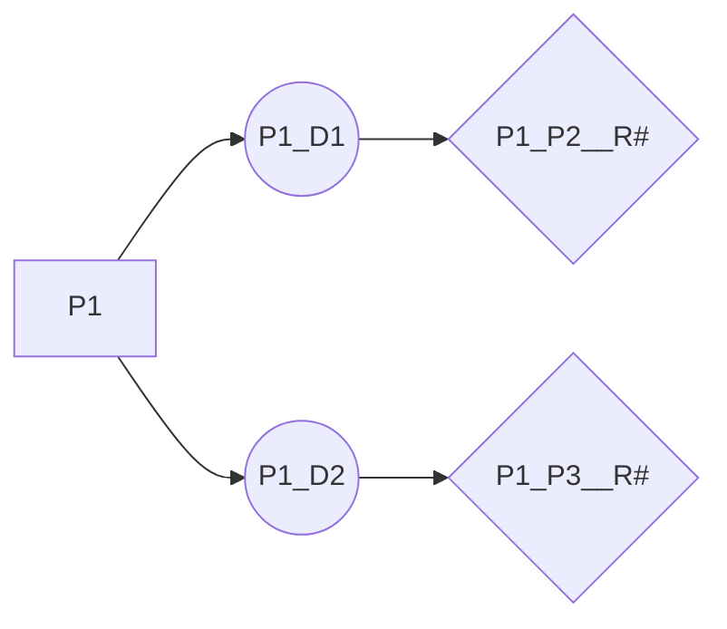

## GBM Implementation of patchMAP

This is an implementation of patchMAP package and its modules in order to structurally model the protein-protein interaction networks. 

## Data

### Patient Networks
In this study, previously reconstructed tumor-specific networks were retrieved from [(Tuncbag et al. 2016)]([https://www.nature.com/articles/srep28668](https://www.nature.com/articles/srep28668)). 

### Protein Structures

Both experimentally determined three dimensional (3D) structures and computationally predicted structures for both the proteins and protein interactions were used. The information of the structures was collected from [Interactome3D](https://interactome3d.irbbarcelona.org/download.php), [Interactome Insider](http://interactomeinsider.yulab.org/downloads/interfacesHQ/H_sapiens_interfacesHQ.txt) and [PRISM webserver](http://cosbi.ku.edu.tr/prism/).

### Functional Domains
In order to find the functional domains on the proteins, [Pfam database](ftp://ftp.ebi.ac.uk/pub/databases/Pfam/releases/Pfam33.1/proteomes/9606.tsv.gz) was used. (Download link for pfam data for human proteome - 9606).

### Oncogenic Mutations
The mutation data for Glioblastoma cell lines were obtained from the 20Q2 version of [CCLE database]([https://depmap.org/portal/download/](https://depmap.org/portal/download/)).

## Scripts

All the corresponding analysis was done with Python language, and the codes and all the necessary data were stored in [this GitHub repository]([https://github.com/CansuDincer/GBM_patchMap](https://github.com/CansuDincer/GBM_patchMap)).

### Structure

There are two folders having scripts and data files. The script folder is **"GBM_patchMAP"** while the folder having data is **"input"**. 

**GBM_patchMAP** folder has **__init__**, **paths**, **GBM_curation**, and **GBM_project** files. The first one the initiation file and the second one has the global paths throughout the project. In the third file, only the interested proteins (inside patient networks) were used to create objects. This module is an minimised version of the curation step inside the patchMAP. Finally, the last one is the analysis and network construction step in where the protein-domain-residue mega networks are created. 

### Visualisation

Each protein in the network graph was represented with its domains and interface residues with oncogenic mutation. Firstly, the proteins were linked with their domains having interaction with another existing protein/its domain in the graph. Secondly, the residues on the domains were searched if they have any oncogenic GBM related mutations, then these residues were also linked with the corresponding domain. 

\* P : Protein, D : Domain, R# : Residue number (In here, the interacted protein names were also given.)

After creating protein representation, all proteins were linked together according to the patient networks. At this point, the priority was to link the interacting domains in the graph, yet the protein-protein or protein-domain linkages were also possible when there is not any domain information. 

The output files are network file and corresponding node attribute file in which proteins, domains and residues were labelled. These files can be used in Cytoscape for visualisation. 

___
### Contact

Please inform us about the problems and also your suggestions in [here](mailto:ntuncbag@metu.edu.tr) or [here](mailto:cansu.dincer@metu.edu.tr). 
___
### Terms and conditions
 
 **PatchMAP**  is a tool that structurally model the proteins and protein interaction interfaces by using experimental and predicted data .

This program is free software: you can redistribute it and/or modify it under the terms of the GNU General Public License as published by the Free Software Foundation, either version 3 of the License, or any later version.

This program is distributed in the hope that it will be useful, but WITHOUT ANY WARRANTY; without even the implied warranty of MERCHANTABILITY or FITNESS FOR A PARTICULAR PURPOSE. See the GNU General Public License for more details.

Neither the institution name nor the name PatchMAP can be used to endorse or promote products derived from this software without prior written permission. For written permission, please contact  [ntuncbag@metu.edu.tr](mailto:ntuncbag@metu.edu.tr).

___

### Further Disclaimer

For policies regarding the underlying data, please also refer to:

-   [DepMap: Terms and Conditions](https://depmap.org/portal/terms/)
- [Cancer Genome Interpreter: Legal Disclaimer](https://www.irbbarcelona.org/en/legal-disclaimer)
- [PDB: Usage Policy](https://www.wwpdb.org/about/privacy)
- [Interactome3D: About](https://interactome3d.irbbarcelona.org/about.php)
- [Interactome Insider: About](http://interactomeinsider.yulab.org/about.html)
- [PRISM: About](http://cosbi.ku.edu.tr/prism/)
